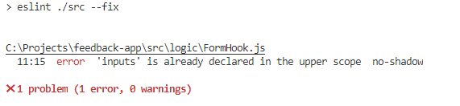
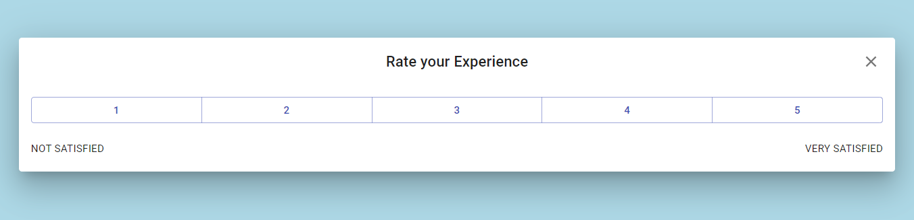

# feedback-app
This project is a sample react based UI for feedback form using react hooks

# Locally SetUp

<ol>
<li>npm install</li>
<li>npm start</li>
<li> your app will run at localhost:3001</li>
</ol>

# Tests

<ol>
<li>npm run test</li>
<li>Used Jest and Enzyme for unit testing</li>
</ol>

<b>Coverage</b>

# Code Quality

<ol>
<li>npm run eslint</li>
<li>Used eslint as the linting tool</li>
</ol>

# User Flow

<ul>
<li>On Mouse Hovering 'Help us improve' Button will appear</li>
<li>On Button click rate card view will appear</li>
<li>When user clicks on the Cancel button (X) top-right, it 
returns to the initial state</li>
<li>Otherwise, user can click a rating</li>
<li>Upon selecting a rate, "Thank you tell us more card will appear"</li>
<li>When user clicks outside feedback form appears</li>
<li>User can fill in details and Click submit button</li>
<li>Thank you card will appear</li>
<li>If user click out side Thank you card will disappear</li>
</ul>

